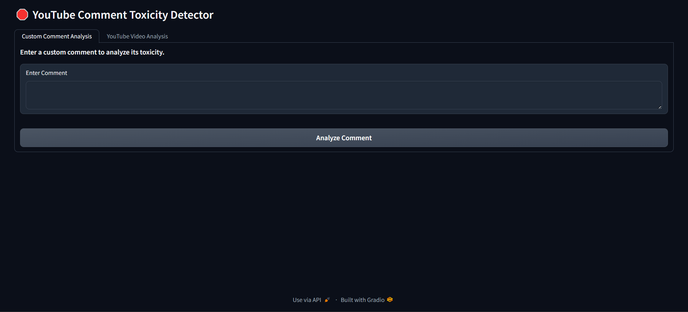
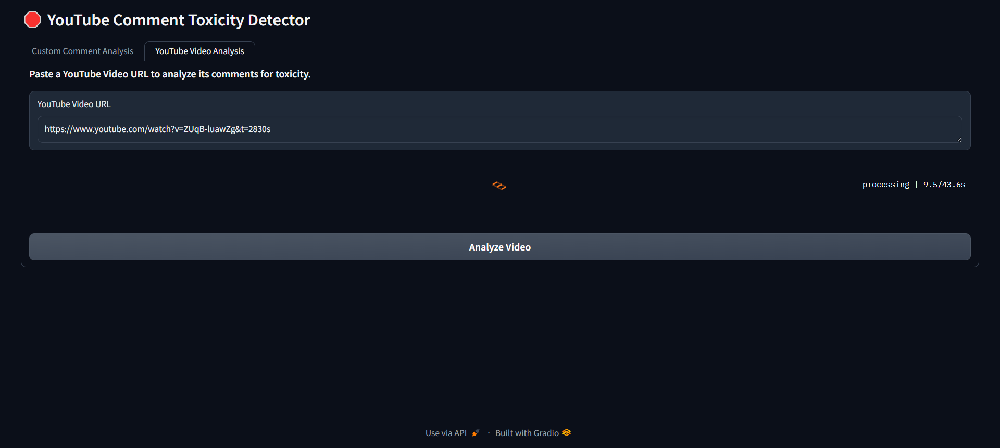
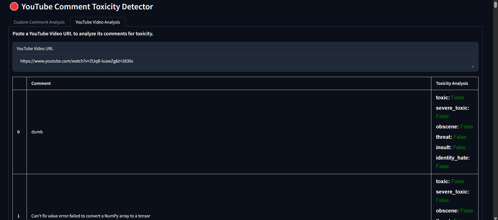

# 🛑 YouTube Comment Toxicity Detector

A **YouTube Comment Toxicity Detector** built using **TensorFlow, NLP, and Gradio** that allows users to check the toxicity of individual comments or analyze the toxicity of comments from any YouTube video.

---

## 🚀 Features

- **Custom Comment Checker:** Enter any text and check its toxicity.
- **YouTube Comment Analyzer:** Fetch comments from a YouTube video and analyze toxicity.
- **Multi-Label Classification:** Detects multiple types of toxicity, including:
  - Toxic
  - Severe Toxic
  - Obscene
  - Threat
  - Insult
  - Identity Hate
- **Interactive UI with Gradio**
- **Color-Coded Output:** 🚨 Red for toxic labels, ✅ Green for non-toxic labels.

---

## 🖥️ Tech Stack

- **Python**
- **TensorFlow / Keras** (Deep Learning Model)
- **NLP (Natural Language Processing)**
- **Pandas & NumPy** (Data Handling)
- **Google YouTube API** (Fetching YouTube Comments)
- **Gradio** (User Interface)

---

## 🛠️ Installation & Setup

### 1️⃣ Clone the Repository
```bash
git clone https://github.com/Codebreaker42/comment-toxicity.git
cd youtube-toxicity-detector
```

### #️⃣ Create a Virtual Environment (Recommended)
```bash
python -m venv your_virtual_env_name
source your_virtual_env_name/bin/activate  # On Mac/Linux
your_virtual_env_name\Scripts\activate     # On Windows
```

### 3️⃣ Install Dependencies
```bash
pip install -r requirements.txt
```

### 4️⃣ Download the Pre-trained Model & Tokenizer
Ensure you have the required **toxicity.keras** model and **vectorizer.pkl**  file in the **comment_checkpoint/** directory.

### ⚙️ Running the Application
🔹 Start the Gradio App
```bash
python app.py
```

🔹 Access the Interface
Once running, open the URL (shown in the terminal) in your browser.

# 🎯 Usage Guide
✅ Check Custom Comment
- Enter a comment in the Text Box.
- Click Analyze.
- See toxicity labels with color indicators
- 🔴 Red → Toxic
- ✅ Green → Not Toxic

✅ Analyze YouTube Comments
- Paste the YouTube Video URL.
Click Analyze.
- View a table of comments with toxicity analysis.
- View a table of comments with toxicity analysis.

# 📸 Screenshots






# 💡 How It Works
### 1.Preprocessing:
- Text is tokenized using a saved vectorizer (vectorizer.pkl).
- The input is padded to MAX_LEN = 1800.
### Model Prediction:
- A deep learning model (toxicity.keras) predicts six toxicity labels.
### YouTube Comments:

- Uses Google YouTube API to fetch comments.
- Each comment is analyzed for toxicity.

# 🔧 Troubleshooting
### Issue: Model Not Found
- Ensure toxicity.keras and vectorizer.pkl exist in the comment_checkpoint/ directory.
### Issue: YouTube API Key Error
- Replace the API key in app.py with your own Google API key.

### 📜 License
This project is open-source and available under the MIT License.

# 🤝 Connect with Me
- 💼 GitHub: https://github.com/Codebreaker42
- 📧 Email: nitinbdkt777@gmail.com

Name

### 🚀 Star this repo if you find it useful! ⭐
